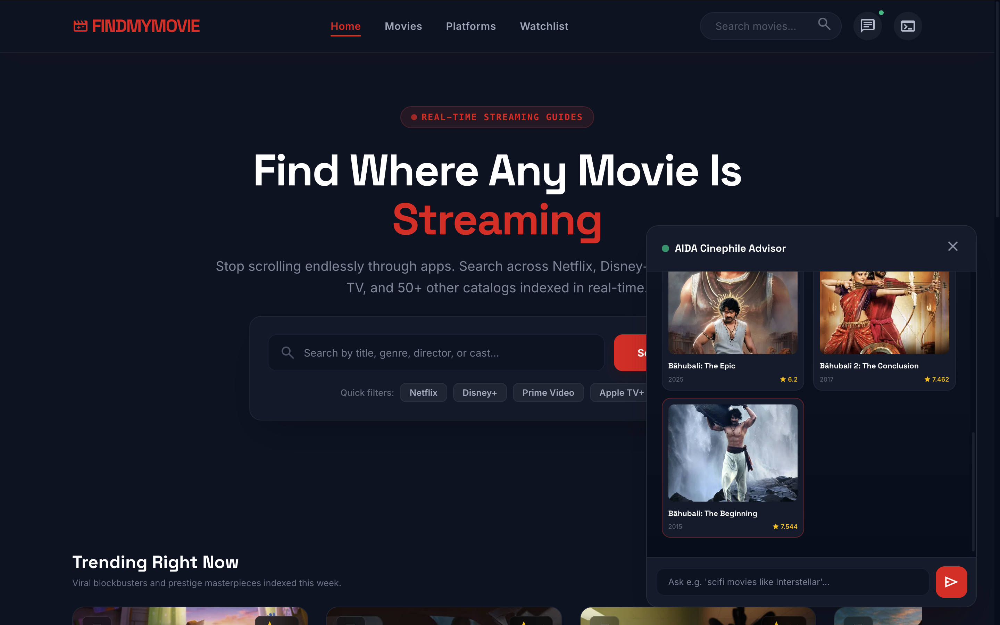
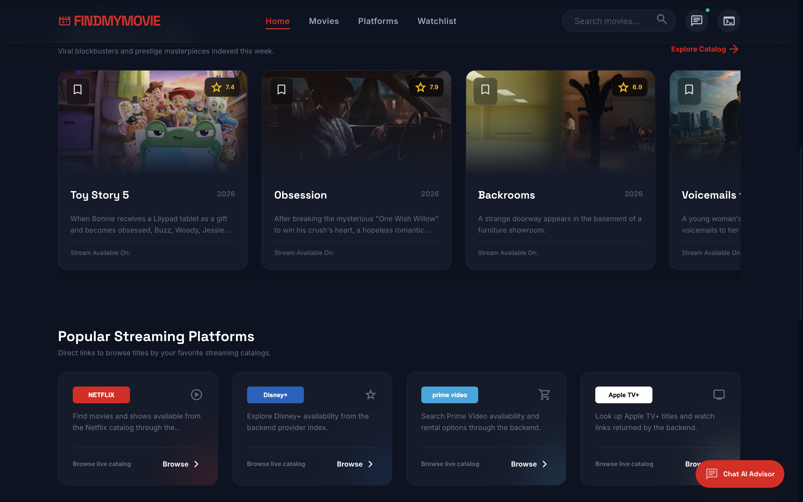
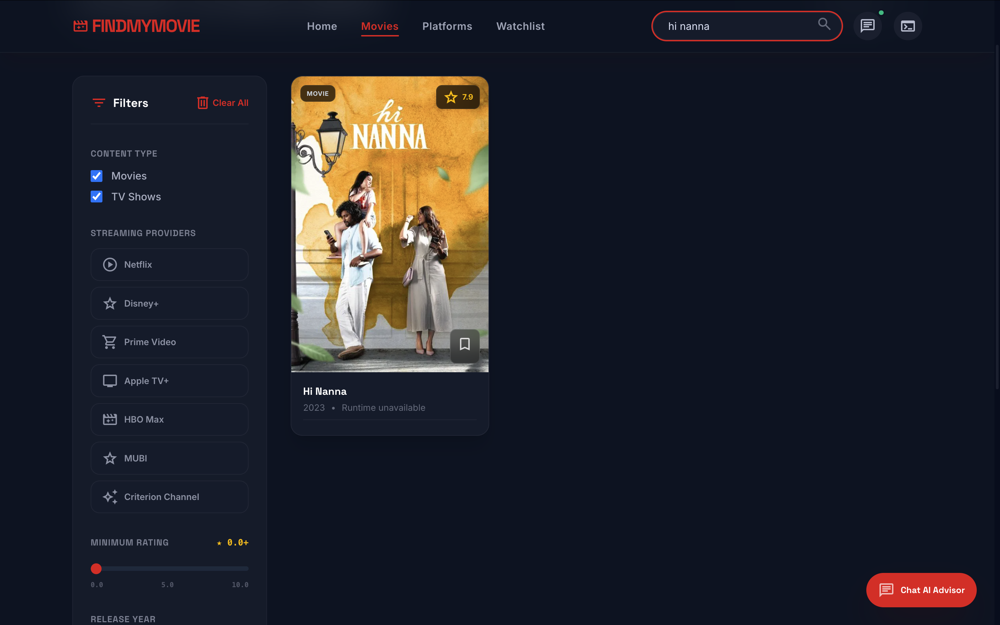
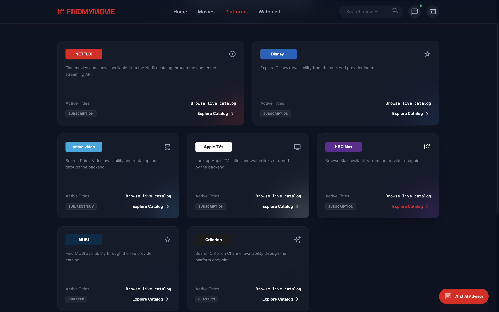
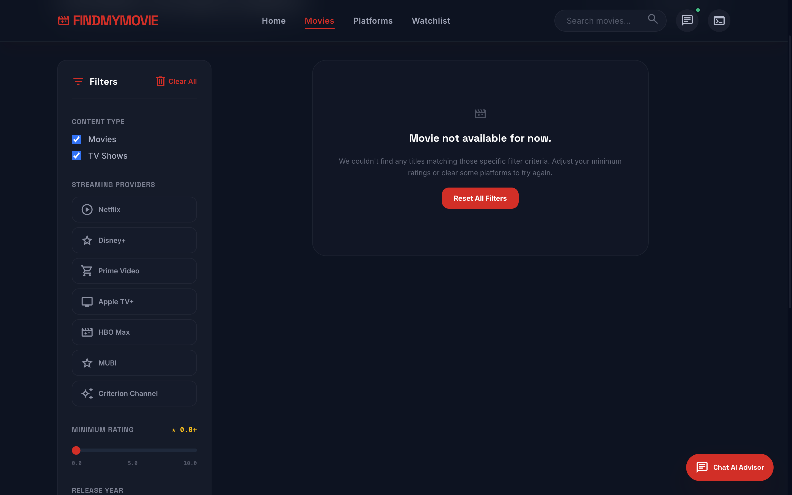
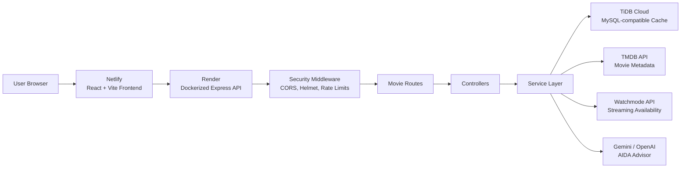
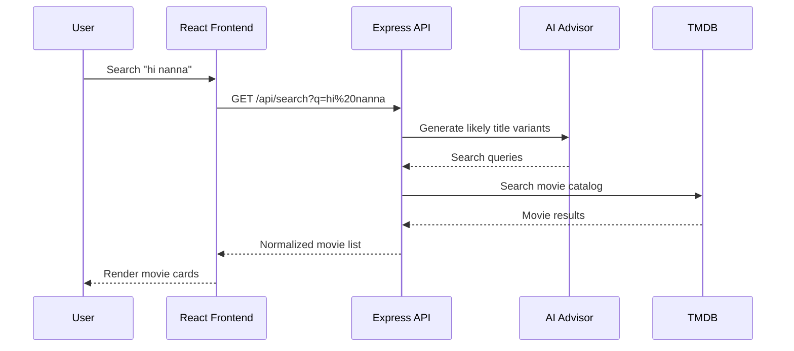
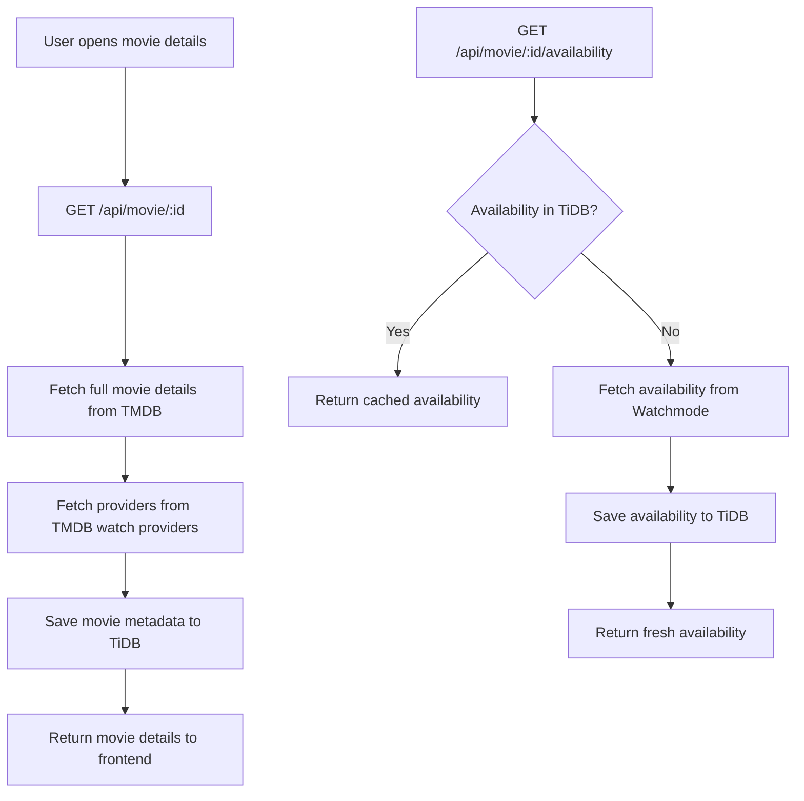
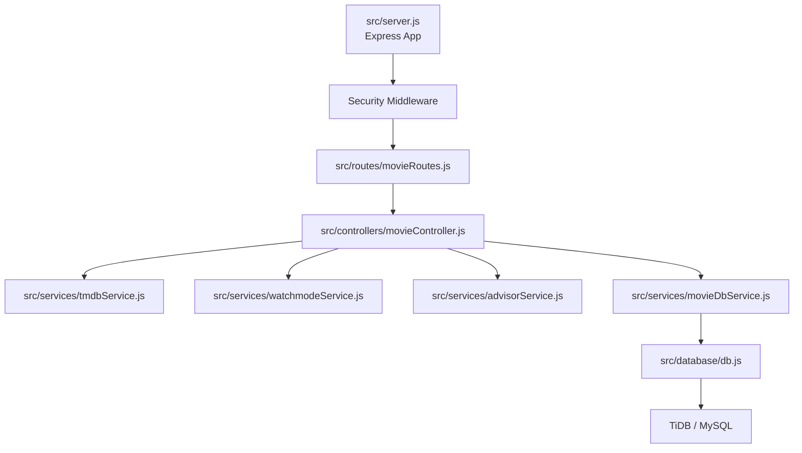

# FindMyMovie

FindMyMovie is a full-stack movie discovery app that helps users quickly find where a movie is available to stream, rent, or buy. It combines a polished React frontend, an Express API, live movie/provider data, an AI search assistant, and a MySQL-compatible cache layer.

> "I find it hard finding where movies exists, if i google it and open the movie it shows not available or rent this irritated me quite a bit"

That frustration is the reason this project exists. Instead of jumping between Google results, Netflix, Prime Video, Disney+, Apple TV+, and other catalogs, FindMyMovie gives users one place to search, compare, filter, and discover where a title can actually be watched.

## Live Product Preview

### Home and AI Advisor



### Trending Titles and Platform Shortcuts



### Movie Search



### Platform Catalogs



### Empty State and Filters



## What It Does

FindMyMovie lets users:

- Search movies by title, genre, director, cast, or rough spelling.
- Browse trending movies.
- Filter by streaming platforms such as Netflix, Disney+, Prime Video, Apple TV+, HBO Max, MUBI, and Criterion.
- View movie metadata including poster, rating, release year, description, runtime, cast, director, and language.
- Check availability through live provider data.
- Ask an AI advisor for natural-language movie recommendations.
- Cache selected movie and availability data to reduce repeated external API calls.

## Tech Stack

| Layer | Technology |
| --- | --- |
| Frontend | React 19, TypeScript, Vite |
| Styling | Tailwind CSS, custom dark UI system |
| UI Icons and Motion | Lucide React, Motion |
| Backend | Node.js, Express.js |
| Database | MySQL-compatible database, TiDB Cloud |
| Database Driver | `mysql2/promise` |
| External Movie Data | TMDB API |
| Streaming Availability | Watchmode API |
| AI Advisor | Gemini API and OpenAI API fallback |
| HTTP Client | Axios |
| Security | Helmet, CORS allowlist, Express Rate Limit, HPP, JSON body limits |
| Deployment | Netlify frontend, Render Docker backend, TiDB Cloud database |
| Containerization | Docker |
| Environment Config | dotenv, Vite environment variables |

## System Design

FindMyMovie is split into three main parts:

- A Vite React frontend hosted on Netlify.
- A Dockerized Express API hosted on Render.
- A TiDB Cloud database used as a MySQL-compatible cache.



## Request Flow

When a user searches for a movie, the frontend calls the backend API. The backend normalizes the query, optionally asks the AI advisor for spelling corrections or title variants, fetches matching movies from TMDB, and returns normalized results to the UI.



## Movie Details and Cache Flow

The backend stores movie details and availability results in TiDB. This keeps repeated lookups faster and reduces unnecessary calls to external APIs.



## Backend Architecture



## API Endpoints

| Method | Endpoint | Purpose |
| --- | --- | --- |
| `GET` | `/health` | Render health check |
| `GET` | `/api/trending` | Get trending movies |
| `GET` | `/api/search?q=movie` | Search movies |
| `POST` | `/api/advisor` | Ask the AI movie advisor |
| `GET` | `/api/platform/:platform` | Browse movies by provider |
| `GET` | `/api/movie/:id` | Get movie details |
| `GET` | `/api/movie/:id/similar` | Get similar movies |
| `GET` | `/api/movie/:id/availability` | Get streaming availability |

## Project Structure

```text
FindMyMovie/
├── Frontend/
│   ├── src/
│   │   ├── components/
│   │   ├── hooks/
│   │   ├── services/
│   │   ├── types/
│   │   └── App.tsx
│   ├── package.json
│   └── vite.config.ts
├── src/
│   ├── controllers/
│   ├── database/
│   │   ├── db.js
│   │   └── schema.sql
│   ├── routes/
│   ├── services/
│   └── server.js
├── docs/
│   └── images/
├── Dockerfile
├── render.yaml
├── netlify.toml
├── package.json
└── README.md
```

## Local Development

### Backend

Create a backend `.env` file from `.env.example`:

```env
NODE_ENV=development
PORT=3000
FRONTEND_ORIGIN=http://localhost:5173
RATE_LIMIT_WINDOW_MS=900000
RATE_LIMIT_MAX=100

DB_HOST=localhost
DB_PORT=3306
DB_USER=root
DB_PASSWORD=your_password
DB_NAME=find_my_movie
DB_SSL=false

TMDB_API_KEY=your_tmdb_api_key
WATCHMODE_API_KEY=your_watchmode_api_key
GEMINI_API_KEY=your_gemini_api_key
OPENAI_API_KEY=your_openai_api_key
```

Install and run the backend:

```bash
npm install
npm run dev
```

The API runs at:

```text
http://localhost:3000
```

### Frontend

Create `Frontend/.env`:

```env
VITE_API_URL=http://localhost:3000
```

Install and run the frontend:

```bash
cd Frontend
npm install
npm run dev
```

The app runs at:

```text
http://localhost:5173
```

## Database Setup

Run this schema in TiDB Cloud or any MySQL-compatible database:

```sql
CREATE TABLE IF NOT EXISTS movies (
    id BIGINT UNSIGNED NOT NULL AUTO_INCREMENT,
    movie_id BIGINT NOT NULL,
    title VARCHAR(255),
    rating DECIMAL(4, 2),
    runtime INT,
    poster TEXT,
    genres TEXT,
    last_updated TIMESTAMP DEFAULT CURRENT_TIMESTAMP,
    PRIMARY KEY (id),
    UNIQUE KEY movies_movie_id_unique (movie_id)
);

CREATE TABLE IF NOT EXISTS availability (
    id BIGINT UNSIGNED NOT NULL AUTO_INCREMENT,
    movie_id BIGINT NOT NULL,
    platform_name VARCHAR(100),
    availability_type VARCHAR(30),
    region VARCHAR(10),
    price DECIMAL(10, 2),
    last_updated TIMESTAMP DEFAULT CURRENT_TIMESTAMP,
    PRIMARY KEY (id),
    KEY availability_movie_id_index (movie_id)
);
```

The same SQL is available in `src/database/schema.sql`.

## Deployment

The production setup uses:

```text
Netlify -> Frontend
Render -> Backend API
TiDB Cloud -> MySQL-compatible database
```

### Render Backend

Render uses the included `Dockerfile`.

Required environment variables:

```env
NODE_ENV=production
TRUST_PROXY=1
FRONTEND_ORIGIN=https://your-netlify-site.netlify.app
RATE_LIMIT_WINDOW_MS=900000
RATE_LIMIT_MAX=100

DB_HOST=your-tidb-host
DB_PORT=4000
DB_USER=your-tidb-user
DB_PASSWORD=your-tidb-password
DB_NAME=your-database-name
DB_SSL=true

TMDB_API_KEY=your_tmdb_api_key
WATCHMODE_API_KEY=your_watchmode_api_key
GEMINI_API_KEY=your_gemini_api_key
OPENAI_API_KEY=your_openai_api_key
```

Health check:

```text
/health
```

### Netlify Frontend

The included `netlify.toml` points Netlify at the Vite app inside `Frontend`.

Build settings:

```text
Base directory: Frontend
Build command: npm run build
Publish directory: Frontend/dist
```

Required Netlify environment variable:

```env
VITE_API_URL=https://your-render-service.onrender.com
```

## Security Features

The backend includes production-focused protections:

- Rate limiting on all `/api` routes.
- Helmet security headers.
- CORS allowlist through `FRONTEND_ORIGIN`.
- Query parameter pollution protection.
- JSON request body size limit.
- Hidden `X-Powered-By` header.
- Compression.
- Render health check endpoint.
- MySQL SSL support for managed cloud databases.

## Why This Project Matters

Movie search looks simple until the user reaches the last step: actually finding where to watch the movie. A title may appear in search results, but then the platform says it is unavailable, region-locked, rental-only, or missing entirely. FindMyMovie is built around that last-mile problem.

The goal is not just to show movie posters. The goal is to reduce the number of dead ends between "I want to watch this" and "here is where it is available."

## Future Improvements

- User accounts and persistent watchlists.
- Regional availability selector.
- More provider integrations.
- Smarter deduplication between TMDB and Watchmode results.
- Personalized recommendation history.
- Admin dashboard for API/cache monitoring.
- Background refresh jobs for stale availability data.

## Author

Built by **Tammana Joshit** as a full-stack streaming discovery platform using real API integrations, cloud deployment, database caching, and a production-minded security layer.
